class: center, middle

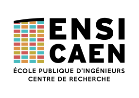
# Outils de développement logiciel
_[Alain Lebret (alain.lebret@ensicaen.fr)]_

<!-- ********************************************************************** -->
---
# A propos du cours
### Objectif
- Maîtriser un environnement et ses outils de développement logiciel

### Modalités
- Cours : 16 h / APP 12 h
- TP    : 22 h / APP 20 h

### Examens
2 notes : 
- TP (coef. 1)
- examen final (coef. 1)

<!-- ********************************************************************** -->
---
# Références


<!-- ********************************************************************** -->
---
# ODL dans la formation

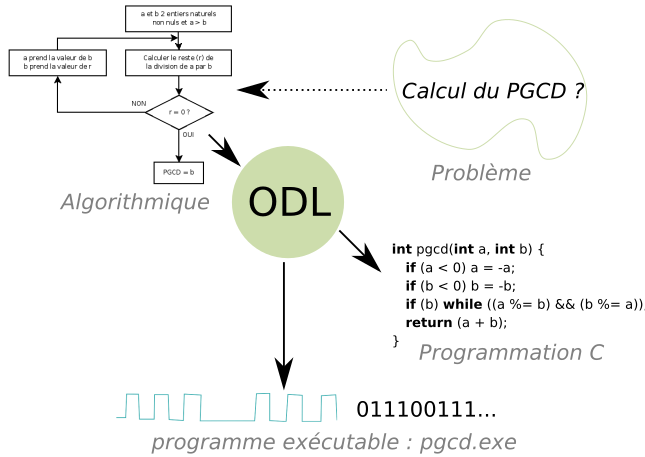

<!-- ********************************************************************** -->
---
# Contenu du cours
1. Introduction
2. Organisation des disques et commandes Unix/Linux
3. Édition
4. Compilation + bibliothèques statiques et dynamiques
5. Utilitaires de développement et mise au point
6. Langage de commande _shell_

<!-- ********************************************************************** -->
---
# Avant l'ordinateur
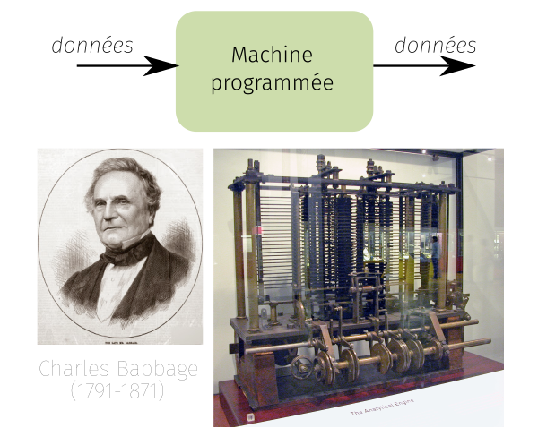

<!-- ********************************************************************** -->
---
# Ordinateur
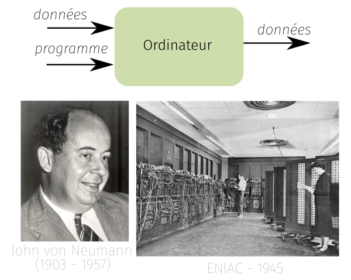

<!-- ********************************************************************** -->
---
# Architecture matérielle (_hardware_)
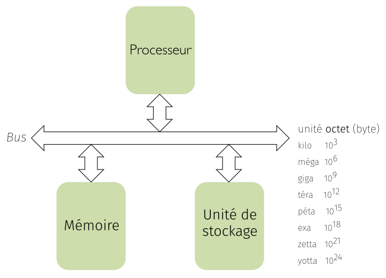

<!-- ********************************************************************** -->
---
# Architecture logicielle (_software_)
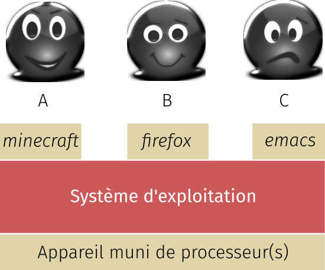

<!-- ********************************************************************** -->
---
# Architecture logicielle (_software_)

 
<!-- ********************************************************************** -->
---
# Principaux environnements
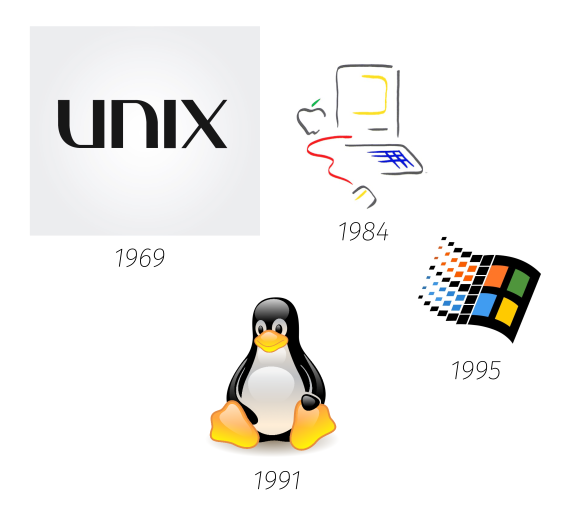

<!-- ********************************************************************** -->
---
# Systèmes d'exploitation des développeurs
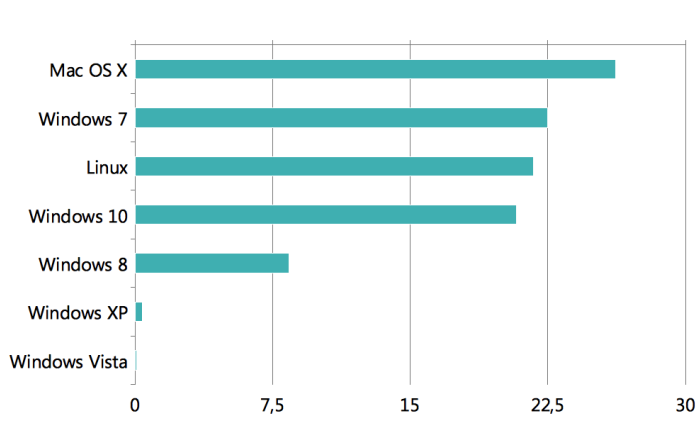
Source : stackoverflow.com, 2016

<!-- ********************************************************************** -->
---
# Systèmes à l'ENSICAEN
Machines sous Ms-Windows + Ubuntu
## Sites de référence
- Institutionnel : [https://www.ensicaen.fr](https://www.ensicaen.fr)
- Cours et TP : [http://foad.ensicaen.fr](http://foad.ensicaen.fr)

## Accès de l'utilisateur Jean Saigne
- Dossier perso : `/home/eleves/promo21/info/jsaigne`
- Espace Web : [http://www.ecole.ensicaen.fr/~jsaigne](http://www.ecole.ensicaen.fr/~jsaigne)
- Espace courrier : 
   - Courriel : jsaigne@ecole.ensicaen.fr ou jean.saigne@ecole.ensicaen.fr
   - Webmail : [https://zimbra.ensicaen.fr](https://zimbra.ensicaen.fr)       
- Accès distant SSH : [ssh://jsaigne@cybele.ecole.ensicaen.fr](ssh://jsaigne@cybele.ecole.ensicaen.fr)
  (clients Ms-Windows : Putty, MobaXterm, etc.)

<!-- ********************************************************************** -->
---
# Bureau Ubuntu
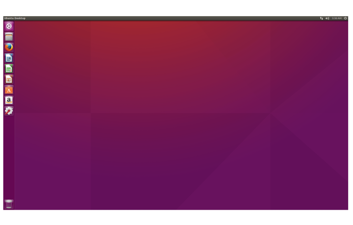

<!-- ********************************************************************** -->
---
# Accès distant Cybèle
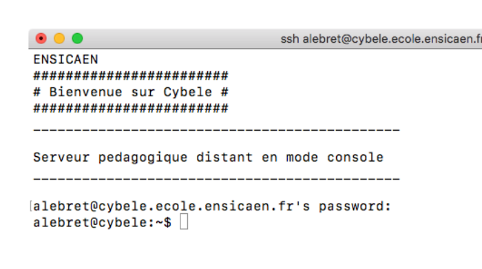

<!-- ********************************************************************** -->
---
# Emacs sur Cybèle
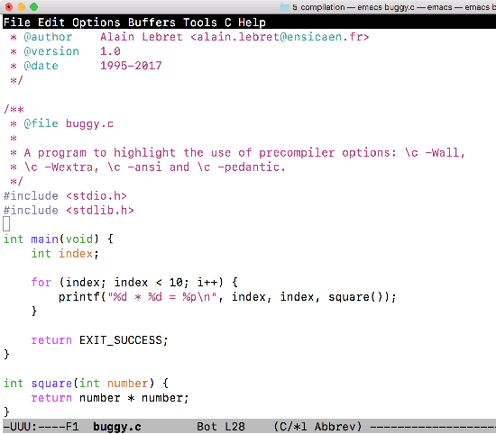

<!-- ********************************************************************** -->
---
# Emacs sur Cybèle
[Chaîne de compilation](./sections/compilation.html)

<!-- ********************************************************************** -->
---
##  Étapes de compilation : *traduction*
### Rôle
Vérification de la syntaxe puis génération du code intermédiaire

### Outil sous-jacent 

- ``` cc1 ``` : **compilateur**

``` {frame="single"}
cc1 [options] fichier.i
```

### Options de *gcc*

- `-c` : compile uniquement sans étape d'édition des liens
- `-Wall` : avertissements
- `-Wextra` : avertissements 
- `-ansi` : vérifie le respect de la syntaxe ANSI
- `-pedantic` : + scrupuleux


```  {frame="single"}
gcc fichier.c -c
```

<!-- ********************************************************************** -->
---
## À propos des syntaxes (K&R, ANSI, C99)
```c
int foo(a, p)
int a,
char *p;
{
   /* ... */
   return 0;
}
```

```c
int foo(int a, char *p) {
   /* ... */
   return 0;
}
```

<!-- ********************************************************************** -->
---
## À propos des syntaxes (K&R, ANSI, C99)
